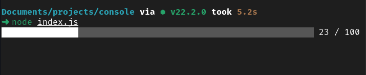
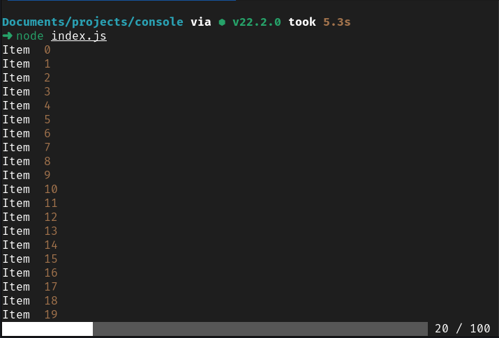

# Progress Helper

A progress bar for node.js scripts.

Requiring progress-helper.js in your node.js scripts will allow you to add a progress bar to your long jobs to visually see where your scripts are currently up to.

You set how many items you are going to loop through and then set the index number on each loop.



You can add `process.stdout.write` and `console.log` inside the loop before setting the current item number. The progress bar will stay as the last line.



## Implementation

Add progress helper to your project
```
const progressHelper = require('path/to/progress-helper');
```

Set progress total before starting loop
```
progressHelper.setTotal(items.length);
```

Increment progress bar count at the start of the loop
```
progressHelper.setCurrent(i);
```

When the `progress.setTotal` function is called, the progress bar with display.

When the `progress.setCurrentTotal` function is called, the progress bar will repaint to reflect the current state and stay as the last line.

When `console.log` or `process.stdout.write` is called, the progress bar will repaint and stay as the last line.

When the number provided as an argument to `progress.setCurrentTotal` is equal to the number provided as an argument to `pogress.setTotal`; the progress bar will no longer repaint and will no longer stay as the last line.

See [example.js](./example/example.js) for a working implementation.
